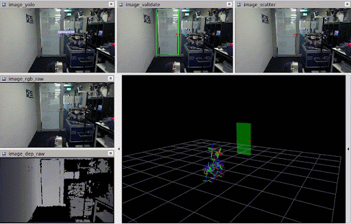

# ROS Package for Door state estimation

[](https://www.python.org/)
[](https://wiki.ros.org)

A ROS package for doors and handles detection, tracking and estimation using [YOLOv5](https://github.com/ultralytics/yolov5) and [python-pcl](https://github.com/strawlab/python-pcl).

**Maintainer:** Yifei Dong
**Affiliation:** Robotic Systems Lab, ETH Zurich (Master thesis project)
**Contact:** yifdong@student.ethz.ch   

## Table of Contents

- [ROS Package for Door State Estimation](#ros-package-for-door-state-estimation)
  - [Table of Contents](#table-of-contents)
  - [Setup Instructions](#setup-instructions)
  - [Build Instructions](#build-instructions)
  - [Running Instructions](#running-instructions)
  - [Acknowledgment](#acknowledgment)

## Setup Instructions

First, clone the project repository to the `src` directory in your catkin workspace:

```bash
git clone git@bitbucket.org:leggedrobotics/alma_handle_detection.git
git checkout yolov5_door_detection
```

To setup the python dependencies, run the bash script:

```bash
./install.sh
```

__Note:__
Please follow the links below to install other necessary dependencies: [tensorrt](https://github.com/NVIDIA/TensorRT) with CUDA 10.2, [python-pcl](https://github.com/strawlab/python-pcl), [vision_opencv](https://github.com/ros-perception/vision_opencv), [geometry2](https://github.com/ros/geometry).

## Build Instructions

Packages geometry2 (tf), python-pcl and vision_opencv (cv_bridge) defaut to python2. To make it compatible with python3.6, some flags are needed as below. (Example paths on Jetson Xavier with ARM64 structure. Please modify them if needed.)

```bash
cd /PATH/TO/catkin_ws
catkin_make -DPYTHON_EXECUTABLE:FILEPATH=/usr/bin/python3 -DPYTHON_INCLUDE_DIR=/usr/include/python3.6m -DPYTHON_LIBRARY=/usr/lib/aarch64-linux-gnu/libpython3.6m.so
source devel/setup.bash
```

## Running Instructions
To obtain the best inference results, please switch models in ... according to the size of your input images.

Change other configs as well according to the names of your dataset. 

Please download bag files from the [link](https://drive.google.com/drive/folders/16u9uYu5A5InifDU48hyCIGuyFZrY8kMx?usp=sharing).

For example use without changing the config, please download [this one](https://drive.google.com/file/d/1rnSXJUNDLSRbkQX87NYmCwkXGWCwl6qj/view?usp=sharing) first.

After downloading, please run the bag in another console:

```bash
rosbag play <name>.bag
```

In another console, run:

```bash
roscore
```

Run the estimator while the bag is re-playing:

```bash
cd src/alma_handle_detection
python3 estimate.py
```

Pause or continue the bag re-play according to the reminders in the console.

When the interactive window pops up, please select RoI (a target door) manually to initialize the estimator.

Vizualize the estimation results in Rviz (door_estimation/viz/rviz.rviz), rqt_image_view, or rqt_multiplot (door_estimation/viz/plot.xml)

```bash
rviz
rqt_multiplot
rqt_image_view
```



## Acknowledgment

The repository is dependent on the code from the following:

- <https://github.com/wang-xinyu/tensorrtx/tree/master/yolov5>
- <https://github.com/ultralytics/yolov5>
- <https://github.com/MiguelARD/DoorDetect-Dataset>


<!-- The pre-trained models of object detector are from [yolov5-models] (https://github.com/ultralytics/yolov5/releases) and trained on [DoorDetect-Dataset] (https://github.com/MiguelARD/DoorDetect-Dataset) with data augmentation. (Please refer to [train-custom-data] (https://github.com/ultralytics/yolov5/wiki/Train-Custom-Data))

The pytorch neural network model is then converted to a TensorRT model using [tensorrtx] (https://github.com/wang-xinyu/tensorrtx/tree/master/yolov5). -->


